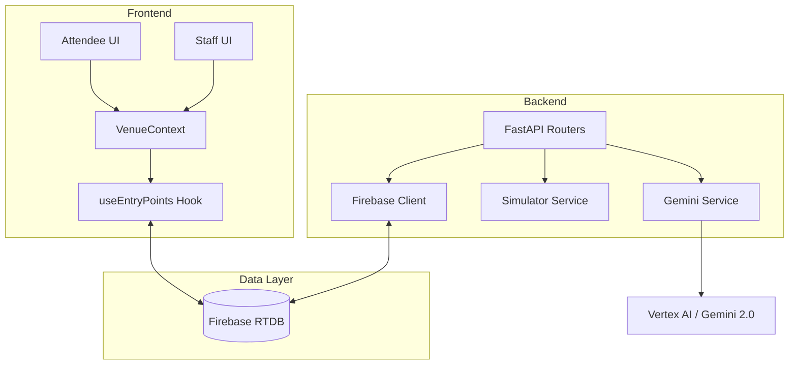
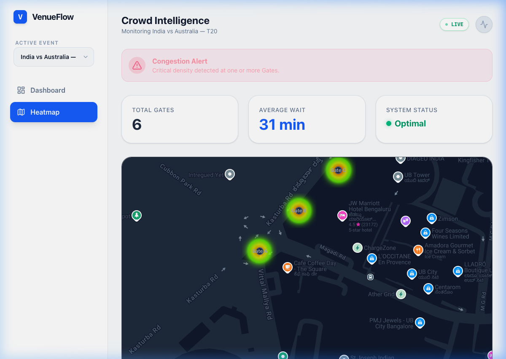
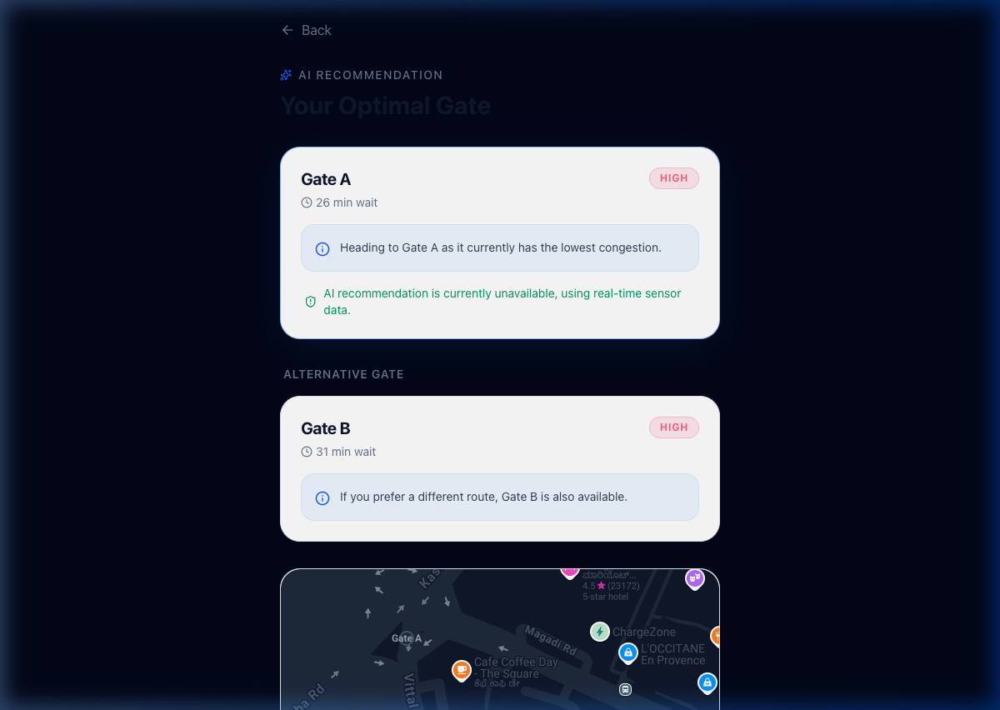
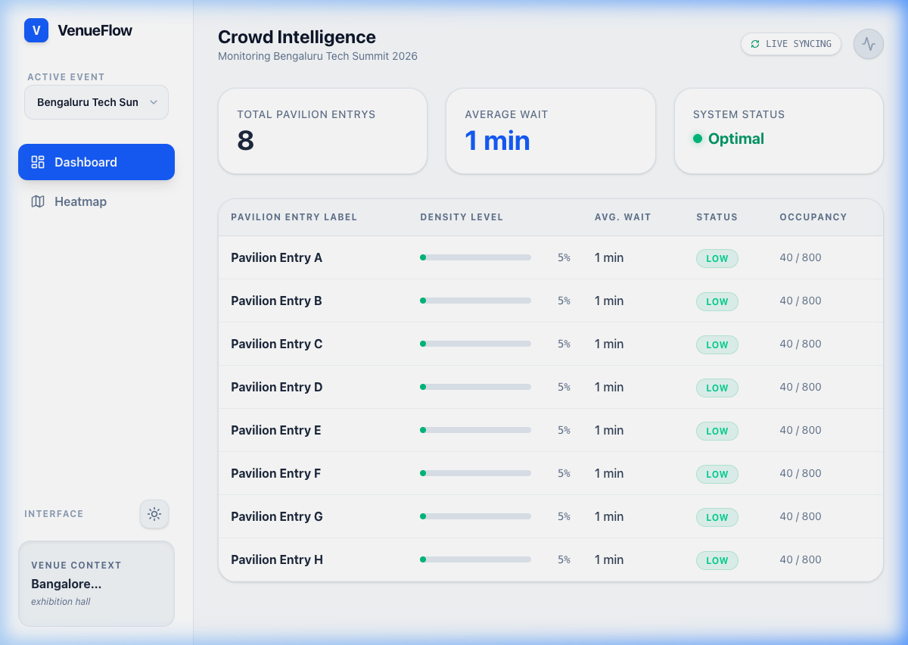

# VenueFlow 🏟️ — Smart Entry & Crowd Intelligence

[](https://github.com/OlixIgnacious/VenueFlow/actions)
[](https://fastapi.tiangolo.com/)
[](https://reactjs.org/)
[](https://deepmind.google/technologies/gemini/)

VenueFlow is a **venue-agnostic, event-type-aware** crowd routing platform. It solves entry-point congestion at large-scale events by providing attendees with personalized AI-powered recommendations and staff with real-time crowd intelligence dashboards.

---

## 🏗️ System Architecture



---

## 🌟 Key Features

### 🧠 Gemini-Powered Recommendations
Intelligent routing logic that understands venue context, event type, and current gate density. The system now supports both **Ticket ID-based resolution** and **Raw Seat Reference routing**, making it resilient to manual inputs and varied ticketing formats.
> [!TIP]
> The AI reconciles denormalized venue config with real-time sensor data to provide "human" tips like *"Gate B is your best bet; it's right by the food court and currently has zero wait."*

### 🗺️ Live Crowd Heatmap
Visual dashboard for venue staff to spot bottlenecks before they form, using Google Maps JS API. Operators can switch between different scheduled events with seamless context synchronization.

### 🔄 Dynamic Event Context Sync
A robust, URL-aware state management system ensures that attendee and staff interfaces always reflect the correct event context, preventing stale data between sessions.

### 🎭 Total Vocabulary Versatility
Labels like "Gate", "Door", or "Pavilion" are injected via configuration — zero hardcoding. Switching from a Football Stadium to a Tech Conference is handled dynamically via the `event_id` context.

---

## 📸 Visual Showcase

<div align="center">
  
  <p><i>Real-time crowd monitoring and operator dashboard.</i></p>
  
  
  <p><i>AI-powered entry point suggestions for attendees.</i></p>
  
  
  <p><i>Geographic heatmapping for active congestion monitoring.</i></p>
</div>

---

## ⚡ Quick Start

### 1. External Services Setup
- **Firebase**: Create a project and enable **Realtime Database** (Test Mode). Generate a Service Account JSON.
- **Google Maps**: Enable **Maps JavaScript API** and **Directions API**.
- **Gemini**: Obtain an API key from [Google AI Studio](https://aistudio.google.com/).

### 2. Environment Configuration
Create a `.env` file in the root directory:
```env
# Backend
GEMINI_API_KEY=your_gemini_key
FIREBASE_DATABASE_URL=https://your-project.firebaseio.com
FIREBASE_CREDENTIALS={"type": "service_account", ...}

# Frontend (Vite)
VITE_MAPS_API_KEY=your_maps_key
VITE_FIREBASE_API_KEY=your_firebase_key
VITE_FIREBASE_DATABASE_URL=https://your-project.firebaseio.com
VITE_FIREBASE_PROJECT_ID=your_project_id
```

### 3. Build & Run
```bash
# Backend Installation
pip install -r backend/requirements.txt
uvicorn backend.main:app --reload

# Frontend Installation
cd frontend && npm install && npm run dev
```

---

## 🛠️ Tech Stack & Security

- **Backend**: FastAPI (Python 3.11) with Google-style Docstrings.
- **Frontend**: React 18 (Vite, Tailwind CSS) with JSDoc standards.
- **AI**: Gemini 2.0 Flash via Vertex AI.
- **Cloud**: Automated keyless deployment to **Google Cloud Run** using GitHub OIDC / Workload Identity Federation.
- **Real-time**: Firebase Realtime Database for sub-second gate density updates.

---

## 📁 Detailed Documentation

For full setup and deployment details, refer to the [Documentation Hub](docs/README.md):
- 📘 [Firebase Setup Guide](docs/firebase_setup_guide.md)
- 📗 [GCP & Secret Manager Guide](docs/gcp_setup_guide.md)
- 📙 [Google Maps API Guide](docs/google_maps_setup_guide.md)

---

## 📝 Project Assumptions & Design Decisions
- **Crowd density is simulated.** Real deployments would use IoT sensors (infrared counters, camera CV models) at each entry point.
- **Secure by Default.** No long-lived service account keys; the entire CI/CD pipeline uses short-lived tokens via Workload Identity.
- **Dynamic Context.** The Gemini prompt builder uses a pure functional approach to scale venue-specific labels without hardcoding.

---
**Hackathon Submission** — *Built for Google Antigravity Challenge*