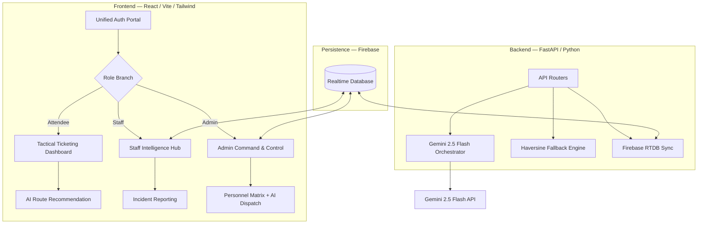

# VenueFlow 🏟️ — AI-Driven Crowd Intelligence Platform

[](https://github.com/OlixIgnacious/VenueFlow/actions)
[](https://fastapi.tiangolo.com/)
[](https://reactjs.org/)
[](https://deepmind.google/technologies/gemini/)
[](https://firebase.google.com/)

**VenueFlow** is a venue-agnostic, event-type-aware crowd routing platform. It eliminates entry-point congestion at large-scale events by giving attendees personalized AI-powered gate recommendations and giving staff a real-time **Tactical Intelligence Hub** for crowd command and control.

**Live:** `https://venueflow-329848942915.us-central1.run.app`

---

## System Architecture

VenueFlow uses a Shell-and-Module architecture. All tactical visualization is consolidated into a singular **Intelligence Hub** component gated by role clearance level.



---

## Role & Access Matrix

| Role | Login Route | Dashboard | Protection |
|:---|:---|:---|:---|
| **Attendee** | `/login` | `/dashboard` | `ProtectedRoute(['attendee'])` |
| **Staff** | `/login` | `/staff/dashboard` → `/staff/event/:id` | `ProtectedRoute(['staff'])` |
| **Admin** | `/login` | `/admin/dashboard` | `ProtectedRoute(['admin'])` |

> **Admin Registration**: New admin accounts require the **Service Key** `TACTICAL_2026` in the New Enrollment form.

---

## Features

### Attendee — Tactical Ticketing
- Claim tickets by Ticket ID via the Perimeter Enrollment form.
- Per-event **AI Route Recommendation** powered by Gemini 2.5 Flash — returns optimal gate, wait time, reason, and walking tips.
- Interactive **Venue Map** with real-time gate density overlay and user geolocation.
- Haversine fallback engine activates automatically when the AI is rate-limited or unavailable.

### Staff — Field Intelligence Hub
- **Deployment Portal**: Zero-tap gate check-in with a 1.2s NFC-style scan animation.
- **Real-time Crowd Monitor**: Live gate density, wait times, and status badges via Firebase RTDB.
- **Incident Transmissions**: Classified incident reporting (Technical / Crowd / Security / Medical) with severity levels (Alpha / Bravo / Charlie).
- **Tactical Redirect Overlay**: Full-screen high-priority directive when Admin dispatches a redeployment order.

### Admin — Command & Control
- **Global Event Grid**: Satellite-view of all active events and venues.
- **Intelligence Hub**: Per-event deep-dive with Gate Monitor, Incident Command log, and Personnel Matrix tabs.
- **Personnel Matrix**: Live staff presence map — who is at which gate, last-seen timestamps.
- **AI Dispatch Advisor**: Gemini-powered redeployment recommendations based on real-time density patterns. One-click `EXECUTE REDIRECT` to broadcast dispatch orders to field staff.

---

## Quick Start

### Prerequisites
- Python 3.11+
- Node.js 20+
- Firebase project with Realtime Database enabled
- Google Gemini API key

### 1. Clone & Install

```bash
git clone https://github.com/OlixIgnacious/VenueFlow.git
cd VenueFlow

# Backend
pip install -r backend/requirements.txt

# Frontend
cd frontend && npm install
```

### 2. Environment Variables

Create a `.env` file in the project root:

```env
# Backend
GEMINI_API_KEY=your_gemini_api_key
FIREBASE_DATABASE_URL=https://your-project-default-rtdb.firebaseio.com
GOOGLE_APPLICATION_CREDENTIALS=credentials/your-firebase-adminsdk.json

# Frontend (also in .env)
VITE_API_BASE_URL=http://localhost:8000
VITE_FIREBASE_API_KEY=your_firebase_web_api_key
VITE_FIREBASE_PROJECT_ID=your_project_id
VITE_FIREBASE_DATABASE_URL=https://your-project-default-rtdb.firebaseio.com
VITE_MAPS_API_KEY=your_google_maps_api_key

# Optional
ADMIN_MASTER_KEY=TACTICAL_2026
```

### 3. Seed Firebase

Populates the database with venues, events, entry points, tickets, and all test accounts:

```bash
python scripts/seed_firebase.py
```

### 4. Run

```bash
# Terminal 1 — Backend
uvicorn backend.main:app --reload --port 8000

# Terminal 2 — Frontend
cd frontend && npm run dev
```

### 5. Deploy (Docker / Cloud Run)

```bash
docker build \
  --build-arg VITE_API_BASE_URL='' \
  --build-arg VITE_FIREBASE_API_KEY=... \
  --build-arg VITE_FIREBASE_PROJECT_ID=... \
  --build-arg VITE_FIREBASE_DATABASE_URL=... \
  --build-arg VITE_MAPS_API_KEY=... \
  -t venueflow .
docker run -p 8080:8080 venueflow
```

---

## Test Accounts

All accounts use the password: **`VenueFlow@1`**

| Role | Email | Notes |
|:---|:---|:---|
| Admin | `admin@venueflow.com` | Full Command & Control access |
| Attendee | `tony@stark.com` | Has ticket `IND-AUS-101` (live event) |
| Attendee | `peter@parker.com` | Has tickets `TECH-EXPO-2026`, `THEME-PARK-NYE` |
| Staff | `staff_1@venueflow.com` … `staff_30@venueflow.com` | Assigned to event_001 & event_004 (1–20), event_005 & event_006 (21–30) |

---

## AI Recommendation Test Scenarios

Run the seed script, log in as an attendee, and test these Ticket IDs:

### 1. Semantic Proximity Match
**Ticket:** `IND-AUS-101` — Seat: *Block B, Row 12*
- Gemini matches "Block B" to **Gate B** via proximity tag analysis.
- Expected: Recommends Gate B with contextual walking tip.

### 2. Congestion Pivot (Safety Override)
**Ticket:** `FEST-VIP-01` — Zone A, Summer Solstice Fest
- Gate A / B / C are at 95%+ density.
- Expected: AI pivots to the nearest low-density Portal (D–L) and explains the override.

### 3. Haversine Fallback (AI Unavailable)
- Trigger: Rate-limit the Gemini API or set an invalid key.
- Expected: System falls back to the Haversine engine, selects the closest gate with <85% density, and displays *"AI reasoning unavailable — using spatial routing fallback."*

---

## Tech Stack

| Layer | Technology |
|:---|:---|
| Frontend | React 18, Vite, Tailwind CSS v4, React Router v6 |
| Backend | FastAPI, Python 3.11, Uvicorn |
| AI | Gemini 2.5 Flash (routing + dispatch advisor) |
| Database | Firebase Realtime Database |
| Auth | Firebase Authentication (Email/Password) |
| Maps | Google Maps JS API (Venue Map component) |
| Testing | Playwright (E2E), Vitest (unit), pytest (backend) |
| CI/CD | GitHub Actions → Google Cloud Run |

---

## Project Assumptions

- **Crowd Density**: Seeded via `scripts/seed_firebase.py`. In production this would pull from IR counters or computer vision camera models.
- **Token Auth**: All backend endpoints validate Firebase ID Tokens via `auth_middleware.py`. The testing bypass (`TESTING=true`) is disabled in production.
- **Real-time**: Gate density and staff presence sync over Firebase RTDB WebSocket connections — no polling.

---

*Built for the Google Antigravity Hackathon Challenge.*
