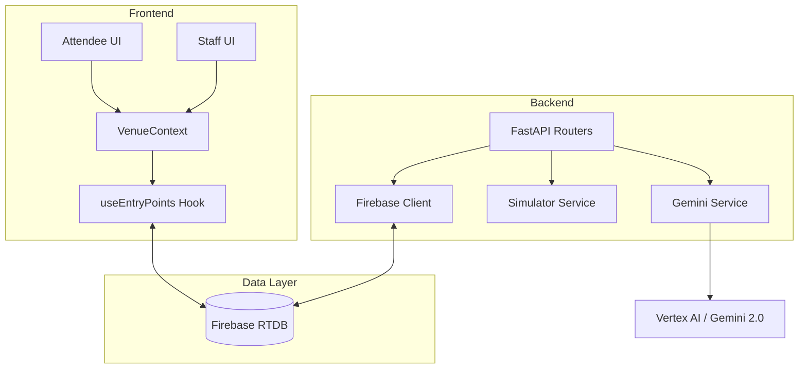

# VenueFlow 🏟️ — Smart Entry & Crowd Intelligence

[](https://github.com/OlixIgnacious/VenueFlow/actions)
[](https://fastapi.tiangolo.com/)
[](https://reactjs.org/)
[](https://deepmind.google/technologies/gemini/)

VenueFlow is a **venue-agnostic, event-type-aware** crowd routing platform. It solves entry-point congestion at large-scale events by providing attendees with personalized AI-powered recommendations and staff with real-time crowd intelligence dashboards.

---

## 🏗️ System Architecture



---

## 🌟 Key Features

### 🧠 Gemini-Powered Recommendations
Intelligent routing logic that understands venue context, event type, and current gate density.
> [!TIP]
> The system reconciles denormalized venue config with real-time sensor data to provide "human" tips like *"Gate B is your best bet; it's right by the food court and currently has zero wait."*

### 🗺️ Live Crowd Heatmap
Visual dashboard for venue staff to spot bottlenecks before they form, using Google Maps JS API.

### 🎭 Total Vocabulary Versatility
Labels like "Gate", "Door", or "Pavilion" are injected via configuration — zero hardcoding. Switching from a Football Stadium to a Tech Conference takes one API call.

---

## 📸 Visual Showcase

````carousel

<!-- slide -->

<!-- slide -->

````

---

## 🛠️ Tech Stack & Security

- **Backend**: FastAPI (Python 3.11) with Google-style Docstrings.
- **Frontend**: React 18 (Vite, Tailwind CSS) with JSDoc standards.
- **AI**: Gemini 2.0 Flash via Vertex AI.
- **Cloud**: Automated keyless deployment to **Google Cloud Run** using GitHub OIDC / Workload Identity Federation.
- **Real-time**: Firebase Realtime Database for sub-second gate density updates.

---

## 📁 Sub-System Documentation

| Component | Description | README |
| :--- | :--- | :--- |
| **Backend** | Python API, Simulator, AI Orchestration | [Explore Backend](backend/README.md) |
| **Frontend** | React SPA, Google Maps Integration | [Explore Frontend](frontend/README.md) |
| **Infrastructure** | Docker & Deployment Guides | [Explore Docs](docs/README.md) |

---

## 📝 Project Assumptions & Design Decisions
- **Crowd density is simulated.** Real deployments would use IoT sensors (infrared counters, camera CV models) at each entry point.
- **Secure by Default.** No long-lived service account keys; the entire CI/CD pipeline uses short-lived tokens via Workload Identity.
- **Dynamic Context.** The Gemini prompt builder uses a pure functional approach to scale venue-specific labels without hardcoding.

---
**Hackathon Submission** — *Built for Google Antigravity Challenge*