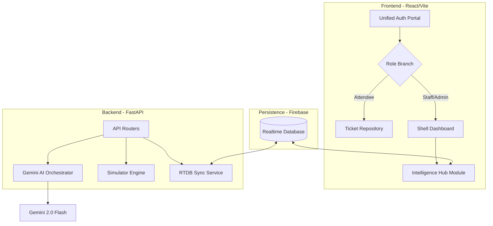

# VenueFlow 🏟️ — Smart Entry & Crowd Intelligence

[](https://github.com/OlixIgnacious/VenueFlow/actions)
[](https://fastapi.tiangolo.com/)
[](https://reactjs.org/)
[](https://deepmind.google/technologies/gemini/)

VenueFlow is a **venue-agnostic, event-type-aware** crowd routing platform. It solves entry-point congestion at large-scale events by providing attendees with personalized AI-powered recommendations and staff with real-time crowd intelligence via a unified **Tactical Intelligence Hub**.

---

## 🏗️ System Architecture

VenueFlow uses a "Shell-and-Module" architecture. Tactical visualization logic is consolidated into a singular **Intelligence Hub** component, which is dynamically gated based on the operator's clearance level.



---

## 🛡️ Hardened Security Matrix

VenueFlow implements a comprehensive security matrix to handle thousands of concurrent users across different permission levels:

| User Role | Entry Point | Target Interface | Protection Guard |
| :--- | :--- | :--- | :--- |
| **Attendee** | `/` | `AttendeeDashboard` | `ProtectedRoute (attendee)` |
| **Staff** | `/staff-gate` | `Intelligence Hub (Tactical)` | `ProtectedRoute (staff)` |
| **Admin** | `/staff-gate` | `Intelligence Hub (Global)` | `ProtectedRoute (admin)` |

> [!IMPORTANT]
> **Persistent State Management**: The dashboards use a state-driven tab system instead of route-based links. This ensures the high-fidelity sidebar remains persistent during tactical maneuvers, preventing UI "ghosting" or re-renders.

---

## 🧬 Tactical Intelligence Hub (Features)

The **Intelligence Hub** is the mission-critical command center for venue operations.

### 🧠 Gemini-Powered Recommendations
Intelligent routing logic that understands venue context, event type, and current gate density. The system reconciles denormalized venue config with real-time sensor data to provide "human" tips.

### 🛡️ Personnel Matrix (Admin Oversight)
A command-and-control dashboard for venue operators to monitor all staff in real-time:
- **Live Presence Detection**: Real-time position tracking at gates via RTDB pulses.
- **Manual Dispatch**: One-click tactical redirection to high-congestion zones.
- **AI TACTICAL Suggestions**: Automated re-assignment recommendations powered by Gemini's system-wide pattern analysis.

### 🚩 Real-time Incident Transmissions (Staff)
A zero-tap tactical reporting system for field personnel:
- **Global Synchronization**: Incidents appear instantly on all log dashboards.
- **Severity-based UI**: Color-coded alerts from technical issues (bravo) to critical emergencies (alpha).

---

## 🧪 Verification & Test Cases

The system's intelligence is validated across three primary operational scenarios. Run `python3 scripts/seed_firebase.py` and use the following Ticket IDs in the Attendee UI:

### 1. Semantic Proximity Matching
**Ticket ID**: `IND-AUS-101`
- **AI Reasoning**: Matches "Block B" seat maps to **Gate B** via semantic tag association.
- **Result**: Recommends Gate B with a logical "human" tip about its location.

### 2. The Congestion Pivot (Safety Priority)
**Ticket ID**: `FEST-VIP-01`
- **AI Reasoning**: Detects >90% density at the closest gate and triggers an immediate safety override.
- **Result**: Pivots the user to the next available low-density portal, even if distant.

### 3. Geospatial Fallback (Resilience)
- **Scenario**: Simulated LLM instability or rate limiting.
- **System Action**: Triggers the mathematical **Haversine Engine**.
- **Result**: Selects the closest gate with `<85%` density. UI notifies: *"AI reasoning unavailable — using spatial routing fallback."*

---

## ⚡ Quick Start

### 1. Build & Run
```bash
# Backend Installation
pip install -r backend/requirements.txt
uvicorn backend.main:app --reload

# Frontend Installation
cd frontend && npm install && npm run dev
```

### 2. Environment (Root .env)
```env
GEMINI_API_KEY=...
FIREBASE_DATABASE_URL=...
VITE_MAPS_API_KEY=...
VITE_FIREBASE_API_KEY=...
```

---

## 📝 Project Assumptions
- **Crowd Density**: Simulated via `scripts/seed_firebase.py`. In production, this pulls from infrared counters or CV camera models.
- **Secure Sessions**: Uses Firebase ID Token verification in the `auth_middleware.py` for all mission-critical endpoints.

---
**Hackathon Submission** — *Built for Google Antigravity Challenge*